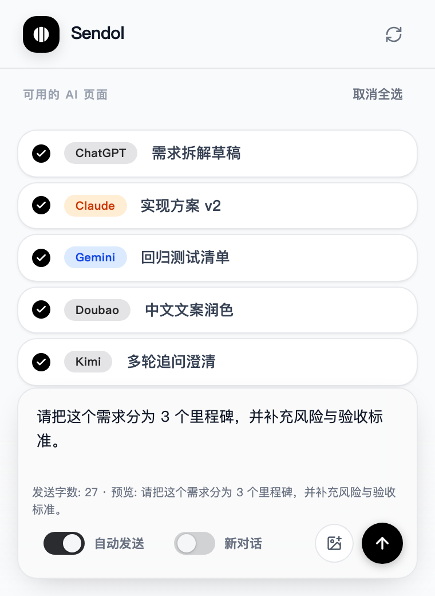

# Sendol

**Broadcast one message to all AI chat windows at once.** A Chrome/Edge extension for power users who juggle ChatGPT, Claude, Gemini, Grok, DeepSeek, Qianwen, Kimi, Doubao, and Mistral.

**一键将同一条消息同步广播到所有 AI 会话窗口。** 支持 ChatGPT、Claude、Gemini、Grok、DeepSeek、千问、Kimi、豆包、Mistral，专为重度 AI 用户与效率极客设计。

<!-- Use a fixed width to avoid GitHub scaling blur; source image is 1024px for Retina displays -->

<!-- Keep screenshot width fixed to reduce GitHub compression blur -->

---

## 💡 Features / 特性

| English | 中文 |
|--------|------|
| **One input, sync everywhere** — Type once, send to all open AI tabs. | **多端同步输入** — 一次输入，自动分发给所有打开的 AI 助手。 |
| **Simultaneous send** — Two-phase broadcast: inject to all tabs first, then trigger send at once. | **同步发送** — 两阶段广播：先注入全部标签，再统一触发发送，各平台近乎同时发出。 |
| **Smart loading feedback** — Send button uses a soft timeout (~50s); if longer, UI exits loading and keeps progress in background. | **智能加载反馈** — 发送按钮采用软超时（约 50 秒）；超时后停止 loading，并在后台持续更新广播进度。 |
| **Auto Send** — Submit to each AI without clicking Send in every tab. | **自动发送** — 无需在各标签页手动点击发送。 |
| **New Chat** — Optionally start a new conversation on each platform. | **新对话** — 可选在各平台开启新对话。 |
| **Minimal UI, keyboard-first** — Vercel-style design, `Ctrl+Enter` to send. | **极简拟物 UI** — 全键盘支持，Ctrl+Enter 发送。 |

## 🔄 Recent Updates / 自动更新

<!-- AUTO_README_UPDATES_START -->
- 2026-03-16 19:49 | v2.26.0 (MINOR) | Content Script / Core | `content.js`, `src/content/adapters/grok.js` <!-- auto:9473aad6d2a1 -->
- 2026-03-16 19:42 | v2.25.0 (MINOR) | Content Script / Core | `content.js`, `src/content/adapters/grok.js` <!-- auto:9e45adee36d4 -->
- 2026-03-16 19:36 | v2.24.0 (MINOR) | Content Script / Core | `content.js`, `src/content/adapters/chatgpt.js`, `src/content/adapters/grok.js` <!-- auto:bf4f0512d549 -->
- 2026-03-16 19:16 | v2.23.0 (MINOR) | Content Script / Core | `content.js`, `src/content/adapters/grok.js` <!-- auto:6e862092c367 -->
- 2026-03-16 19:07 | v2.22.0 (MINOR) | Content Script / Core | `content.js`, `src/content/adapters/grok.js` <!-- auto:5618504c241c -->
- 2026-03-16 18:54 | v2.21.0 (MINOR) | Content Script / Core | `content.js`, `src/content/adapters/grok.js` <!-- auto:3ed611681bc6 -->
- 2026-03-16 18:39 | v2.20.0 (MINOR) | Content Script / Core | `content.js`, `src/content/adapters/chatgpt.js`, `src/content/core/injection.js` <!-- auto:4b6e9f6695ed -->
- 2026-03-16 18:30 | v2.19.0 (MINOR) | Content Script / Core | `content.js`, `src/content/core/injection.js` <!-- auto:4a015183fa49 -->
- 2026-03-16 18:13 | v2.18.0 (MINOR) | Content Script / Core | `content.js`, `src/content/adapters/chatgpt.js`, `src/content/adapters/grok.js`, `src/content/core/injection.js`, `src/content/index.js`, `src/content/selectors.js` <!-- auto:a7e60ddd1feb -->
- 2026-03-16 17:06 | v2.17.0 (MINOR) | Core / Popup UI | `app/popup.html`, `app/src/popup/Popup.jsx` <!-- auto:d26bfd268d46 -->
- 2026-03-16 16:48 | v2.16.0 (MINOR) | Manifest/Permissions / Core | `manifest.json`, `package.json` <!-- auto:0c8f1b2f947e -->
- 2026-03-16 16:37 | v2.15.0 (MINOR) | Background / Content Script / Core | `background.js`, `content.js`, `src/content/core/utils.js`, `src/content/index.js`, `test-results.json` <!-- auto:3df9b82bd1ef -->
<!-- AUTO_README_UPDATES_END -->

---
## 🚀 Supported Platforms / 支持平台

| Platform | 官网 / Official URL |
|----------|---------------------|
| ChatGPT (OpenAI) | chatgpt.com, chat.openai.com |
| Claude (Anthropic) | claude.ai |
| Gemini (Google) | gemini.google.com |
| Grok (xAI) | grok.com |
| DeepSeek | chat.deepseek.com |
| Mistral | chat.mistral.ai |
| 豆包 Doubao (字节跳动) | www.doubao.com |
| 通义千问 Qianwen (阿里云) | www.qianwen.com, tongyi.aliyun.com |
| 元宝 Yuanbao (腾讯) | yuanbao.tencent.com |
| Kimi (月之暗面) | kimi.com, kimi.moonshot.cn, kimi.ai |

---

## 🛠 Installation / 安装

This extension is not on the Chrome Web Store yet. Load it manually in **Developer mode**:

本插件暂未上架 Chrome 网上应用店，请通过**开发者模式**手动加载：

1. **Get the code** / **获取代码**
   - Click **Code** → **Download ZIP**, then unzip.
   - 或 Git 克隆：`git clone https://github.com/RainTreeQ/sendol-extension.git`
2. **Open extensions** / **打开扩展页面**
   - Chrome: `chrome://extensions/`
   - Edge: `edge://extensions/`
3. Turn on **Developer mode** / 开启右上角 **开发者模式**。
4. Click **Load unpacked** / 点击 **加载已解压的扩展程序**。
5. Select the **project root folder** (the one containing `manifest.json`) / 选择解压后的**项目根目录**（包含 `manifest.json` 的文件夹）。
6. Popup entry is `app/dist-extension/popup.html` (prebuilt in repo). If missing locally, run `npm run build:extension` in project root once. / 弹窗入口为 `app/dist-extension/popup.html`（仓库已预构建）；若你本地缺失，请在项目根执行一次 `npm run build:extension`。

## 🎯 Usage / 使用说明

| Step | English | 中文 |
|------|--------|------|
| 1 | Open the AI sites you need (e.g. ChatGPT, Claude, Gemini) in separate tabs. | 在浏览器中打开需要使用的 AI 平台页面。 |
| 2 | Click the **Sendol** icon in the toolbar. | 点击浏览器右上角的 Sendol 图标。 |
| 3 | The extension scans and lists all detected AI tabs. | 插件会自动扫描并列出当前支持的 AI 窗口。 |
| 4 | Type your message in the input box. | 在输入框内输入内容。 |
| 5 | (Optional) Enable **Auto Send** and/or **New Chat**. | （可选）勾选「自动发送」「新对话」。 |
| 6 | Press **Ctrl+Enter** (or Cmd+Enter on Mac) or click Send to broadcast. | 按 **Ctrl+Enter** 或点击发送，完成广播。 |

---

## ⚠️ Behavior Notes / 行为说明

- English: Some sites only expose the message input after login; if not logged in, detection may fail.
- 中文：部分平台必须登录后才会出现输入框；未登录时可能出现“未检测到”。
- English: The send button loading has a soft timeout (about 50 seconds). If exceeded, popup shows background-progress text and continues processing.
- 中文：发送按钮 loading 有软超时（约 50 秒）。超过后会显示“后台处理中”提示，并继续广播流程。
- English: Safe guard rules are enabled for auto text injection by default. Risk controls are evaluated automatically in background and can temporarily disable auto-send.
- 中文：默认启用自动文本注入的安全策略。后台会自动评估风控信号，并在必要时临时关闭自动发送。
- English: Image upload keeps the safest default path: manual upload on each platform tab. You can use **Locate Upload** to highlight likely upload entries (still no automatic cross-site image upload).
- 中文：图片上传默认采用最安全方式：在各平台页面手动上传。你可以使用 **定位上传** 按钮高亮可能的上传入口（仍不做跨站自动图片上传）。
- English: Microsoft Copilot / Bing is intentionally out of scope in current versions.
- 中文：当前版本明确不支持 Microsoft Copilot / Bing。

---

## 🌐 Website Pages / 网站页面

| 页面 | 路径 | 用途 |
|------|------|------|
| Landing Page / 落地页 | `/` | 对外线上页面，展示功能价值、安装入口、收费与支持信息 |
| Design System / 设计系统 | `/design-system` | 项目内部页面，用于组件规范与视觉对齐，不作为营销落地页 |

本地预览命令：

- `npm run dev --prefix app`
- 打开 `http://localhost:5173/`（落地页）或 `http://localhost:5173/design-system`（设计系统）

站点构建命令：

- `npm run build:site`
- `npm run build:design-system`

---

## 📂 Development / 开发说明

**Which files affect what** / **哪些修改会生效**

| 模块 | 文件 | 生效方式 |
|------|------|----------|
| Popup UI (source) | `app/src/popup/`, `app/src/components/ui/`, `app/src/index.css` | 修改后执行 `npm run build:extension` 生成 `app/dist-extension/`，再在 chrome://extensions 里点「重新加载」 |
| Popup UI (runtime) | `app/dist-extension/` | 仅作为扩展运行产物，不手工编辑 |
| Landing / Site runtime | `app/dist-site/` | 仅用于落地页构建产物，不参与扩展运行 |
| 后台 / 广播逻辑 | `background.js` | 保存后到 chrome://extensions 点击「重新加载」 |
| 注入与平台适配 | `content.js`, `shared/platform-registry.js` | 同上 |
| 扩展配置与权限 | `manifest.json` | 同上 |

See [app/docs/L3-EXTENSION-INTEGRATION.md](app/docs/L3-EXTENSION-INTEGRATION.md) for details. 详见该文档。

**Release checklist** / **发布前检查**

- `npm run build:extension`
- `npm run package:extension`（生成最小发布目录与体积报告）
- `npm run test:popup`
- `npm run release:stage`（构建并暂存 `app/dist-extension/`，同时输出最小发布包报告）

---

## 🔒 Privacy / 隐私安全

**English:** This extension runs entirely on your device. It uses a local broadcast flow only — **no collection, storage, or upload** of your chats, passwords, or any personal data. See [Privacy Policy](privacy.md).

**中文：** 本插件在本地运行，使用点对点广播机制。所有数据均在本地处理，**不收集、不存储、不上传**任何聊天记录、账号密码或隐私信息。详见 [隐私政策](privacy.md)。

---

## 📄 License / 许可证

Starting from **v2.0.0**, this project is dual-licensed:

- **Open-source**: [GNU AGPL-3.0-or-later](LICENSE)
- **Commercial**: [Commercial Licensing Notice](COMMERCIAL_LICENSE.md)
- **Branding**: [Trademark Policy](TRADEMARK_POLICY.md)

Historical releases published under MIT (such as `1.x`) remain under MIT for
the corresponding released code.
